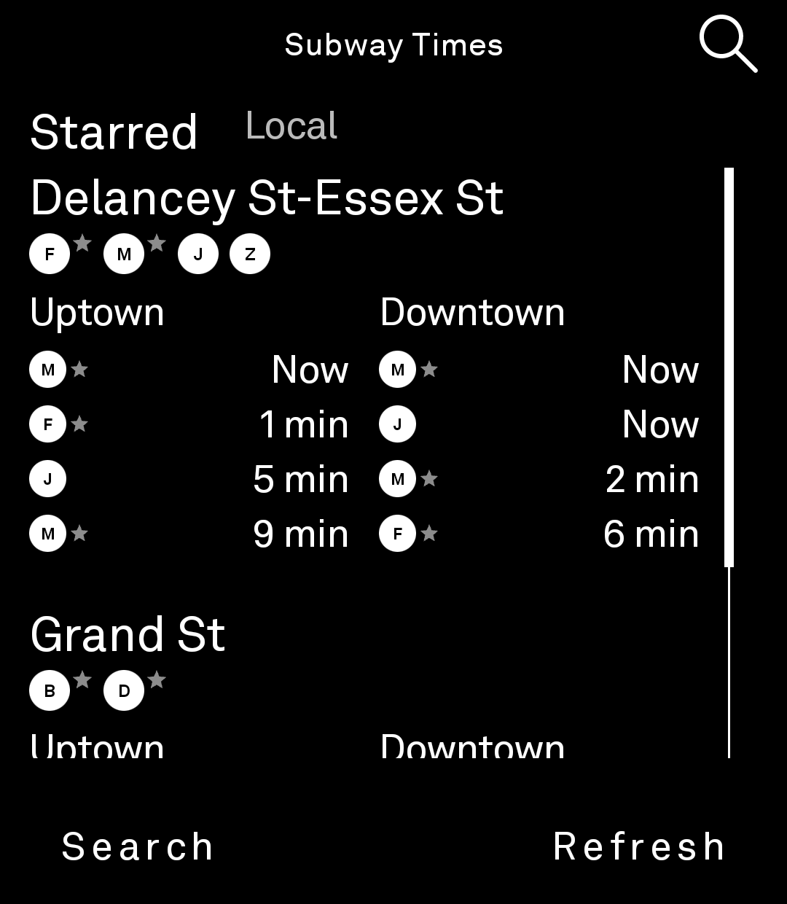
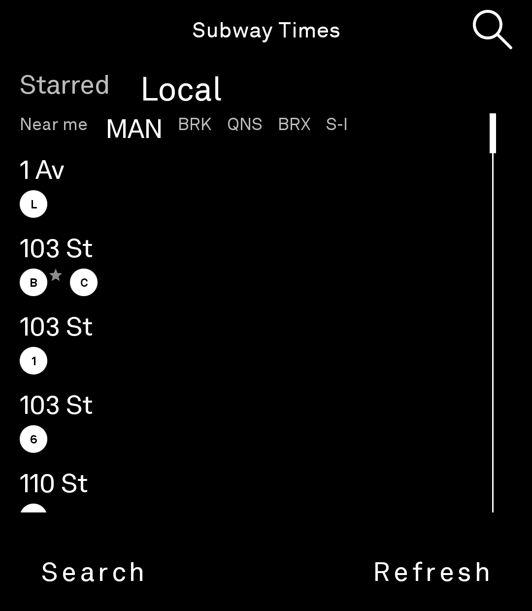

# LightNYCSubway

Live subway arrival times for New York City, on the Light Phone III. LightOS shows the
tool as **Subway Times**.

Part of the [gi-os Light App collection](#the-gi-os-light-app-collection).

## What it does

- Reads the MTA GTFS-realtime feeds directly. There is no middle server and no API key.
- Opens on your saved station and shows two columns, Uptown and Downtown, soonest train
  first.
- Draws the real route bullets, so a `6` reads as a `6` and not as a letter in a box.
- Merges platforms by MTA Complex ID, so a transfer station appears once instead of four
  times.
- Searches the whole system from a bundled catalog of about 500 stations, held in
  `assets/stations.json`.
- Stores the chosen station on the device. The tool asks for `INTERNET` and nothing
  else.

## How it stays fast

The station catalog parses once, off the main thread, and then caches process-wide. An
earlier build parsed it during composition and the phone showed a black screen at
launch. `StationCatalog.load` now takes an asset reader and is safe to call from any
thread, more than once.

Each station maps to the set of MTA feeds that serve it. `ArrivalsRepository` requests
those feeds at the same time, drops trains that already left, removes duplicates, and
sorts by time. A feed that fails returns an empty list rather than an error, so one bad
feed does not empty the board.

## Layout of this repository

This is the [light-sdk](https://github.com/lightphone/light-sdk) tree with one tool
added. Upstream code stays where upstream put it, which keeps a rebase cheap.

| Path | What it is |
| --- | --- |
| `examples/LightNYCSubway/` | The tool |
| `examples/LightNYCSubway/src/main/kotlin/.../ArrivalsRepository.kt` | Feed fetch and GTFS-realtime decode |
| `examples/LightNYCSubway/src/main/kotlin/.../StationCatalog.kt` | Cached station parse |
| `examples/LightNYCSubway/src/main/kotlin/.../HomeScreen.kt` | Uptown and Downtown columns |
| `examples/LightNYCSubway/src/main/kotlin/.../StationScreen.kt` | Station search and selection |
| `examples/LightNYCSubway/src/main/assets/stations.json` | Station and stop catalog |
| `examples/LightNYCSubway/lighttool.toml` | Tool identity, version and permissions |
| `sdk/`, `plugin/`, `builder/`, `docs/`, other `examples/` | Upstream light-sdk |

## Build

```sh
./gradlew :examples:LightNYCSubway:assembleDebug
```

You need JDK 17 and the Android SDK. The SDK client libraries come from GitHub Packages,
so set a token with package-read access first:

```sh
export GITHUB_ACTOR=<your-username>
export GITHUB_TOKEN=<token-with-read:packages>
```

You can put `gpr.user` and `gpr.key` in `local.properties` instead. Never commit either
one.

`.github/workflows/build-apk.yml` builds the tool on each push to `main` that touches
`examples/LightNYCSubway/`, and attaches the APK to a GitHub Release.

## Run it

To run against the LightOS emulator, set `serverPackage = "com.thelightphone.sdk.emulator"`
in `examples/LightNYCSubway/lighttool.toml`. Set it back to `com.lightos` before a device
build. The SDK [system-app guide](docs/system_app/README.md) covers the one-time emulator
setup.

## Screenshots

<table>
  <tr>
    <td align="center">
      <br>
      <sub>Starred stations, live arrivals</sub>
    </td>
    <td align="center">
      <br>
      <sub>Browse by borough</sub>
    </td>
  </tr>
</table>

Taken on a Light Phone III against the live MTA feeds.

## Origin and credits

- **[lightphone/light-sdk](https://github.com/lightphone/light-sdk)** is the base of
  this repository. The whole tree is a fork. The Light Phone team wrote the SDK client,
  the Gradle plugin, the lint rules, the builder and the emulator, and released all of
  it under MIT before the platform was even public. Thank you.
- **[MTA](https://api.mta.info/)** publishes the GTFS-realtime feeds and the station
  data as open data. The station catalog derives from it.
- **[Ktor](https://github.com/ktorio/ktor)** and
  **[OkHttp](https://github.com/square/okhttp)** move the bytes. A hand-rolled decoder
  reads the protobuf, so the tool stays inside the SDK dependency allowlist.
- The Light Phone, LightOS and Light Phone III are names of The Light Phone. This is an
  unofficial community tool.

This repo set the pattern the rest of the collection reuses. Fork light-sdk, write the
tool into a module the SDK reserves for it, leave upstream alone, and let a GitHub
Actions workflow build the APK. [LightRSS](https://github.com/gi-os/LightRSS) and
[LightSolitaire](https://github.com/gi-os/LightSolitaire) both follow it.

## The gi-os Light App collection

Nine tools for the Light Phone III, all open source, all built in one run.

| Tool | What it does | Built on |
| --- | --- | --- |
| [LightPass](https://github.com/gi-os/LightPass) | Photograph a movie ticket, keep the stub | Plain Android |
| [LightQR](https://github.com/gi-os/LightQR) | QR scanner, plus a browser generator | Plain Android |
| [LightRSS](https://github.com/gi-os/LightRSS) | RSS and Atom reader with images and QR subscribe | light-sdk, fork of [zachattack323/LightRSS](https://github.com/zachattack323/LightRSS) |
| **LightNYCSubway** (this repo) | Live MTA subway arrivals | light-sdk fork |
| [chat](https://github.com/gi-os/chat) | iMessage over a self-hosted BlueBubbles server | Fork of [craigeley/chat](https://github.com/craigeley/chat) |
| [LightFog](https://github.com/gi-os/LightFog) | Fog of World companion, GPS recorder and fog map | Fork of [garado/light-topographic](https://github.com/garado/light-topographic) |
| [LightNonogram](https://github.com/gi-os/LightNonogram) | Picross, plus a generator that only ships solvable puzzles | Kotlin generator, light-sdk tool |
| [LightSolitaire](https://github.com/gi-os/LightSolitaire) | Klondike, draw one, unlimited redeals | light-sdk |
| [LightFastread](https://github.com/gi-os/LightFastread) | RSVP speed reader for EPUB and MOBI | Fork of [fluffyspace/FastRead](https://github.com/fluffyspace/FastRead) |

The Light Phone does not sponsor or endorse any of these.

## License

MIT, the same as upstream light-sdk. See [LICENSE](LICENSE).
